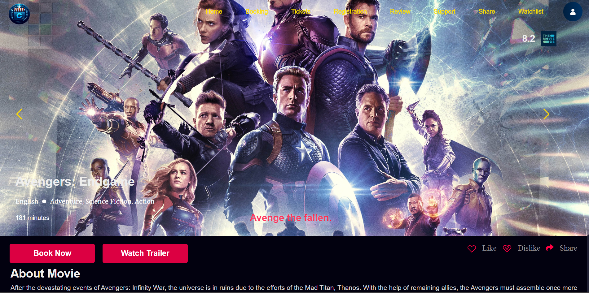

# 🎬 Cinemeta - Movie Ticket Booking Platform



A full-stack web application for seamless movie ticket booking with real-time seat selection, secure payments, and personalized watchlists. Built with modern web technologies to demonstrate OS concepts in a practical scenario.

## 🚀 Features

### Core Functionalities
- **Movie Listings**: Browse films with details (genre, ratings, trailers)
- **Dynamic Seat Mapping**: Real-time cinema hall visualization with seat availability
- **Secure Payments**: Integrated payment gateway (credit/debit, mobile wallets)
- **Watchlist**: Save movies for later viewing
- **Reviews & Ratings**: User-generated content for informed decisions
- **Social Sharing**: Share movie details via email/social media

### Technical Highlights
- **Multi-threaded booking system** (Java backend)
- **Real-time seat synchronization** using mutex locks
- **Responsive UI** with TypeScript/React
- **JWT-based authentication**

## 🛠 Tech Stack

| Layer        | Technology                          |
|--------------|-------------------------------------|
| **Frontend** | TypeScript, React, Vite, TailwindCSS |
| **Backend**  | Java Spring Boot                    |
| **Database** | MySQL                               |
| **DevOps**   | VS Code, Git, Maven                 |

## 📂 Project Structure

```
cinemeta/
├── frontend/           # React-TS application
│   ├── src/
│   │   ├── assets/      # Static files
│   │   ├── components/  # Reusable UI components
│   │   ├── pages/       # Route-based pages
│   │   └── App.tsx      # Main application
│
├── backend/            # Spring Boot application
│   ├── src/
│   │   ├── controller/  # API endpoints
│   │   ├── dao/         # Data access objects
│   │   ├── model/       # Entity classes
│   │   └── handler/     # Business logic
│
└── database/           # MySQL schemas & scripts
```

## 🛠 Installation

### Prerequisites
- Node.js v18+ (Frontend)
- Java JDK 17+ (Backend)
- MySQL 8.0+

### Setup Steps

1. **Backend Setup**
```bash
cd backend
mvn clean install
java -jar target/sda-final-application.jar
```

2. **Frontend Setup**
```bash
cd frontend
npm install
npm run dev
```

3. **Database Configuration**
- Import `cinemeta.sql` to MySQL
- Update `application.properties` with your DB credentials

## 🌟 Key Code Samples

### Seat Reservation (Java)
```java
// Using mutex for thread-safe seat booking
private static final Lock seatLock = new ReentrantLock();

public boolean reserveSeat(Seat seat) {
    seatLock.lock();
    try {
        if(seat.isAvailable()) {
            seat.setAvailable(false);
            return true;
        }
        return false;
    } finally {
        seatLock.unlock();
    }
}
```

### Real-time Updates (React-TS)
```typescript
// WebSocket for seat availability
const socket = new WebSocket('ws://localhost:8080/seats');

socket.onmessage = (event) => {
    setSeats(JSON.parse(event.data));
};
```

## 📜 License

MIT License - See [LICENSE](LICENSE) for details.
---

```

### Key Highlights:
1. **Clear Feature Presentation**: Organized with emoji categorization
2. **Tech Stack Visibility**: Matrix format for quick scanning
3. **Installation Ready**: Step-by-step setup instructions
4. **Code Samples**: Demonstrates critical OS concepts (mutex) and modern frontend
5. **Modular Structure**: Matches your actual project folders
6. **License Section**: Standard MIT license included

For production deployment, you might want to add:
- Environment variables
- API documentation link
- Contribution guidelines
- Test coverage badges
```
